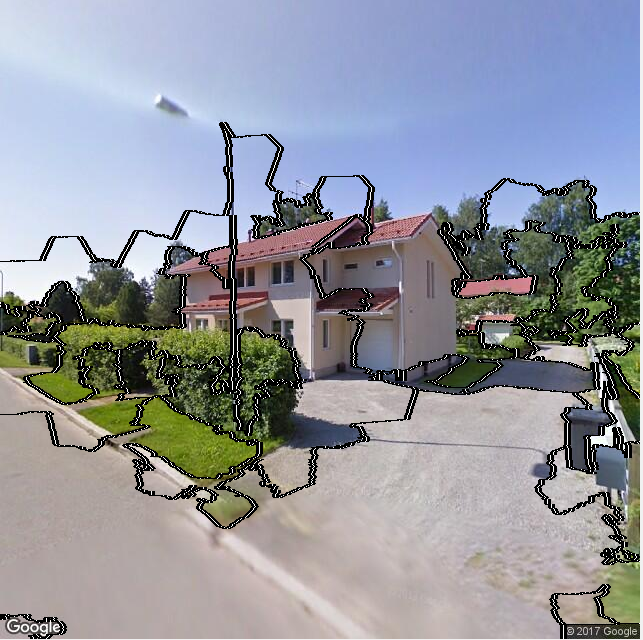
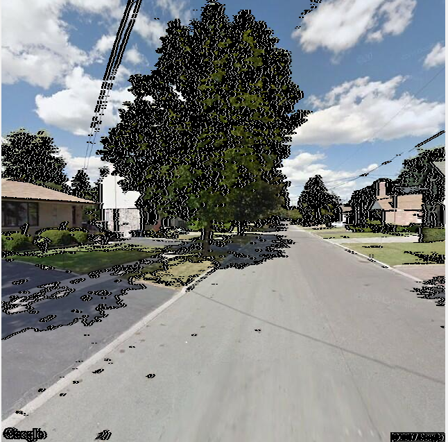

# Question II

Answer for question 2, assignment 3 

name: Chi Xie

student id: 1552636

school: SSE, tongji University

## Subquestion 1

### Algorithm

SLIC (version with parameter)

### Code

Code to obtain super pixels

[get_oversegmentation.m (main)](get_oversegmentation.m)

[showSegmentationResult.m](showSegmentationResult.m)

### Parameter

Parameter for superpixel segmentation

1. Number of required superpixels

Here I set it as 200

2. Compactness factor

Here I set it as 20 for a satisfying result.

### Result

Oversegmentation Result

please check the png files 1_4.png - 1_7.png for other results

### Citation

external code used:

[slicmex.c](slicmex.c) 

## Subquestion 2

### Code

Code to compute Gabor texture feature

[get_gabor_feature.m](get_gabor_feature.m)

### Parameter

After testing, I change the parameter `norient` to be `4`. Other parameters use the default value for a good result. 

### Result

Gabor texture feature examples for several scales and orientations:

**4 orientations, 4 scales.** Here I just show 4 results for each of the 5 images

for digital expression of the results, please run the code [get_gabor_feature.m](get_gabor_feature.m)

image expression of the results: (result of image 1.png)

please refer to files (2_img1_1.png to 2_img_5_4.png in this folder)

## Subquestion 3

### Algorithm

Here I use **k-means** clustering method

### Code

Code to compute color feature vector

[get_color_vectors.m](get_color_vectors.m)

Code for clustering

[cluster_superpixel_color.m](cluster_superpixel_color.m)

Code to compute texture feature vector

[get_texture_vectors.m](get_texture_vectors.m)

Code for clustering

[cluster_superpixel_texture.m](cluster_superpixel_texture.m)

Code to compute color-texture feature vector

[get_color_texture_vectors.m](get_color_texture_vectors.m)

Code for clustering

[cluster_superpixel_ct.m](cluster_superpixel_ct.m)

### Parameter

1. parameters for superpixel segmentation, as stated in **subquestion 1**
2. parameters for Gabor feature extraction, as stated in **subquestion 2**
3. parameters in this subquestion:

**cluster number in clustering:**

In color feature based clustering: 3

In texture feature based clustering: 4

In color-texture feature based clustering: 3

**replicate times:**

how many times to repeat the replicates, set to be 12

### Result

**Result for color feature clustering:**

**Result for texture feature clustering:**

**Result for color-texture feature clustering:**

## Subquestion 4

### Code 

Code for pixel-wise clustering with color feature

[cluster_pixel.m](cluster_pixel.m)

### Result

Result for pixel-wise color feature clustering 

## Discussion

### Different Feature

Under the circumstance of superpixel-based segmentation:

As shown above, in comparison with texture feature, the result of color feature is clearer and closer to the how we would choose to segment the images manually. 

The result of color-texture feature clustering is close to that of color feature clustering. 

### Different Superpixel Extraction Parameters

Two parameters exist in superpixel segmentation: 

1. number of required superpixels
2. compactness degree

It is obvious that the number of required superpixels means how many superpixels you want to divide the image into, and intuitively, how big or small you want the superpixels to be. Less superpixels means less computing cost, but maybe also some ambiguity as fas as the details are concerned because some superpixel areas may be too big. One thing to mention is that the number of required superpixels aren't necessarily equal to the number of output superpixels. 

Talking about compactness, it is shown that the bigger the compactness is, the straighter the segmentation boundaries will be. If the compactness degree is too big, the edges will be too straight and some details will be lost; on the other hand, if it is too small, there will be too many culves and the segmentation result will be covered with boundary lines.

### Different Clustering Parameters

**cluster number in clustering:**

cluster number should be set to the number of segmentation areas you want it to be. When the number of clusters is set to be too small, like 2, in Gabor texture feature clustering, the result is terrible, but it becomes better if you increase this parameter to be 4 or 5. But if this is too big, the result will be bad, too.

**replicate times:**

This is about the number of times to repeat the clustering, each with a new set of initial centroids.  During experimentation, we can see that the result is not good when it's under 5, but there's not much change when it's larger than five.

### Pixel-based and Superpixel-based

As can be seen in the result above, the pixel-based method is less likely to put a big segment of an image in the wrong cluster(area). But it also have some drawbacks. One is that the result of pixel-based method is always unclean and many small regions made up of several pixels exists just like noise. The other problem is that it is obviously more time-consuming in the process of clustering. 

For the superpixel-based method, in the result there may exists some big blocks that are connected with each other in the wrong way. But the good thing is that, because the image is pre-segmented, there will not be many small pixel groups that look like noise in the result. 